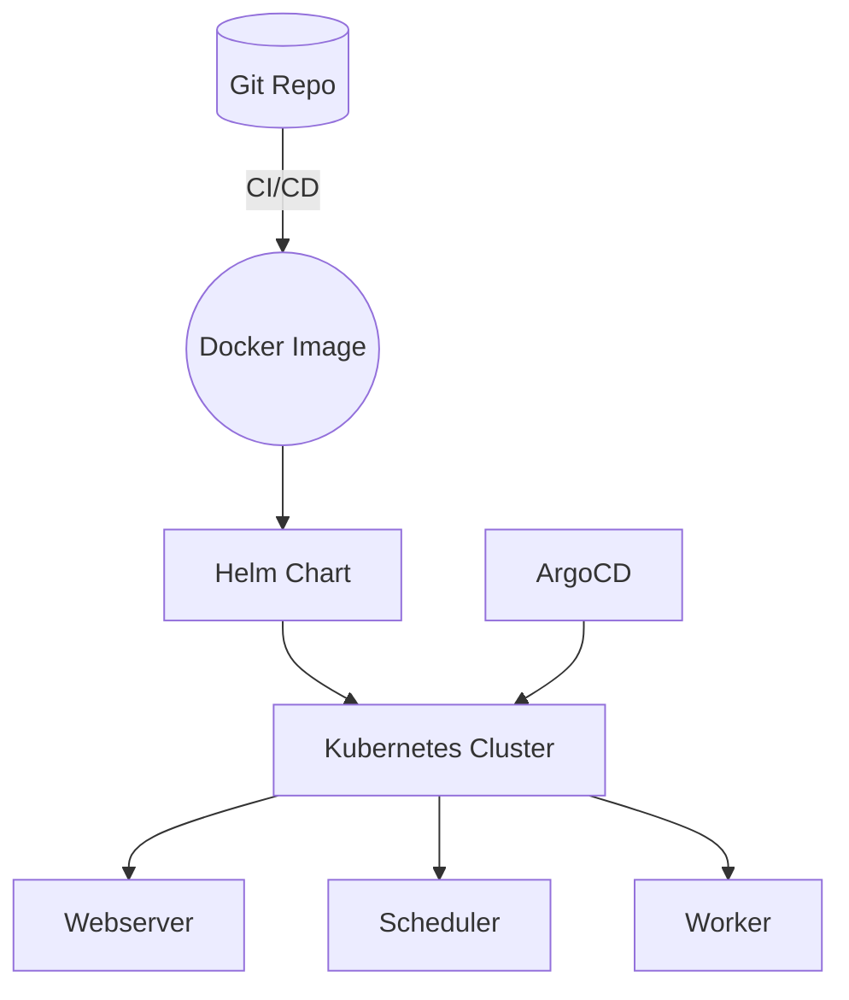

# airflow-alpine-k8s

A lightweight Apache Airflow distribution built on Alpine Linux and tailored for Kubernetes. The project provides Dockerfiles, Helm charts and ArgoCD manifests so you can deploy Airflow using a GitOps workflow.

## Table of Contents
- [Repository Structure](#repository-structure)
- [Quick Start](#quick-start)
- [Docker Image](#docker-image)
- [Helm Chart](#helm-chart)
- [ArgoCD Deployment](#argocd-deployment)
- [Architecture](#architecture)
- [Testing](#testing)
- [Documentation](#documentation)
- [Contributing](#contributing)
- [Monitoring](#monitoring)

## Repository Structure
- **docker/** – Dockerfiles and helper scripts
- **helm/** – Helm chart wrapper and values
- **k8s/** – Kubernetes manifests and ArgoCD definitions
- **docs/** – Extended documentation
- **tests/** – Test cases and utilities

## Quick Start
1. Build the image:
   ```bash
   docker build -t airflow-alpine -f docker/Dockerfile .
   ```
2. Install the Helm chart:
   ```bash
   helm dependency update helm
   helm install airflow helm -f helm/values-alpine.yaml
   ```
3. Optionally deploy via ArgoCD (see [docs/argocd.md](docs/argocd.md)).

## Docker Image
The Docker image is based on Alpine and contains just the packages required to run Airflow. See [docs/docker-build.md](docs/docker-build.md) for details on customizing the build and for a list of installed packages.

## Helm Chart
The chart in `helm/` wraps the official Airflow chart and replaces the image with the Alpine variant. Configuration options are documented in [docs/helm-customization.md](docs/helm-customization.md).

## ArgoCD Deployment
Kustomize manifests under `k8s/argocd` allow you to deploy the chart using ArgoCD. Overlays are provided for `dev`, `staging` and `prod` environments. A step-by-step tutorial is available in [docs/argocd.md](docs/argocd.md).

## Architecture

More information can be found in [docs/architecture.md](docs/architecture.md).

## Monitoring
Sample manifests for Prometheus, Grafana and Loki reside in `k8s/monitoring`.
See [docs/observability.md](docs/observability.md) for setup details.

## Testing
Test scripts in the `tests/` directory cover linting, vulnerability scanning and Kubernetes integration. Run the basic checks with:
```bash
./tests/test_hadolint.sh
./tests/test_trivy.sh
./tests/test_packages.sh
./tests/test_docker_build.sh
./tests/test_user_permissions.sh
```

The security-related tests expect `hadolint`, `trivy`, `cosign` and `kube-score` to be installed.

Additional suites for end-to-end and performance testing are also available.

## Upgrade: Werkzeug 3.1.3 and Flask/FAB

- Goal: Move the image to Werkzeug 3.1.3 with a deterministic, pinned dependency set compatible with Flask 3 and Flask-AppBuilder.
- Implementation:
  - Custom constraints are generated via `pip-tools` from `constraints.in` against the official Airflow constraints for the detected Airflow/Python versions.
  - The file `constraints.custom.txt` is checked in and copied into the image. The Docker build uses `PIP_CONSTRAINT` for deterministic installs.
  - The Dockerfile retains non-root user, slim Alpine base, and adds a healthcheck for the webserver.
- Validation:
  - Unit tests in `tests/unit/test_auth.py` verify CSRF, session cookie flags, and safe login redirects.
  - Integration in `tests/integration/test_container.py` builds/starts webserver, scheduler, triggerer; verifies `/health`, logs in programmatically, and runs a trivial DAG.

### Rollback Notes

If a specific provider or plugin cannot be upgraded:
- Pin that provider in `constraints.in` to the last known compatible version and re-run `make deps`.
- If still incompatible, remove that provider from `constraints.in` and document the limitation here with exact conflict pairs and versions.
- As a temporary workaround, you can set `Werkzeug==2.2.3` and recompile constraints to confirm the regression point.

Known limitations: None identified so far for the default set of providers included (`amazon`, `google`, `cncf-kubernetes`, `postgres`) on Airflow 3.0.x and Python 3.12.

## Documentation
- [Docker Build Guide](docs/docker-build.md)
- [Helm Customization](docs/helm-customization.md)
- [ArgoCD Tutorial](docs/argocd.md)
- [Troubleshooting](docs/troubleshooting.md)
- [Security Considerations](docs/security.md)
- [Disaster Recovery](docs/disaster-recovery.md)
- [Performance Tuning](docs/performance.md)
- [Architecture](docs/architecture.md)
- [Monitoring Stack](docs/observability.md)

## Contributing
Please read [docs/contributing.md](docs/contributing.md) if you wish to contribute patches or bug reports.
