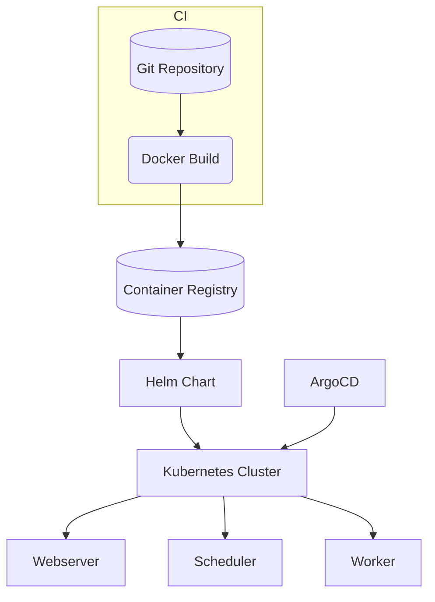

# Architecture

The diagram below shows the high-level components involved when deploying the project on Kubernetes.

The Docker image is built from the files in `docker/` and pushed to a registry. The Helm chart pulls this image and installs Airflow pods in the cluster. ArgoCD monitors the Git repository and applies any configuration changes automatically.
